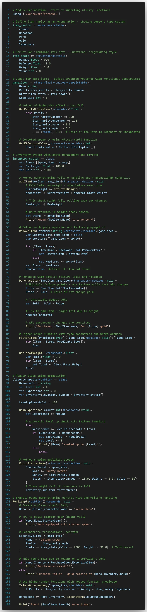

# Verse Language

Syntax highlighting for the [Verse programming language](https://verselang.github.io/book/).

## Features

- Syntax highlighting for `.verse` files.
- Covers keywords, control flow, operators, built-in types, literals, and specifiers.
- String interpolation highlighting (`{expr}` inside strings).
- Nested block comments (`<# ... #>`).
- Bundled **Verse Dark** color theme with distinct colors for specifiers like `<public>`, `<transacts>`, etc.

## Usage

Files with a `.verse` extension are automatically highlighted. To use the bundled theme, open the Command Palette (`Ctrl+Shift+P`) and select **Preferences: Color Theme → Verse Dark**.

## Example

